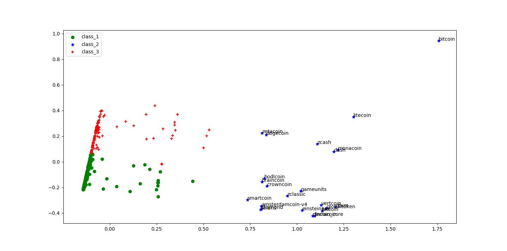
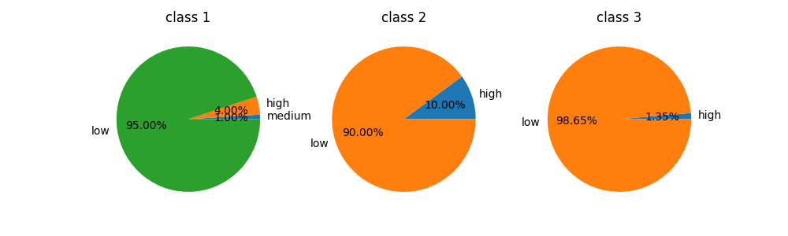
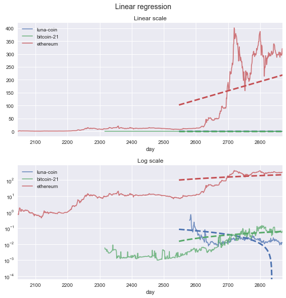
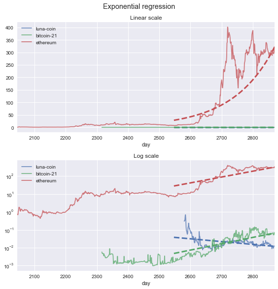

# Gitchain

GitHub repository meets crptocurrencies.

## Setup

**Fill your username and password of GitHub first** in [config/config.ini](config/config.ini), then:

```bash
# install environment
$ virtualenv -p python3 .env
$ source .env/bin/activate
$ pip install -r req.txt
```

## Structures

- [app](./app): web application
- [config](./config): creeper config
- [data](./data): data
- [models](./models): our models
  + cluster
  + linear
  + prediction
- [utils](./utils): data creeper

## Insights & Conclutions

Features:

- repo size
- number of watchers
- number of forks
- number of open issues
- number of subscribers
- number of contributors
- implement language
- stars
- days since create date
- days since last update
- historical price regression slope value
- sentiment from articles

Most important features:


- days since create date
- days since last update
- historical price regression slope value
- sentiment from articles
- number of open issues
- stars
- repo size
- number of forks
- number of subscribers
- number of contributors

Methods:

- Supervised
  + price regression
- Unsupervised
  + clustring
- Feature selection
  + PCA











## License

MIT &copy; Contributors